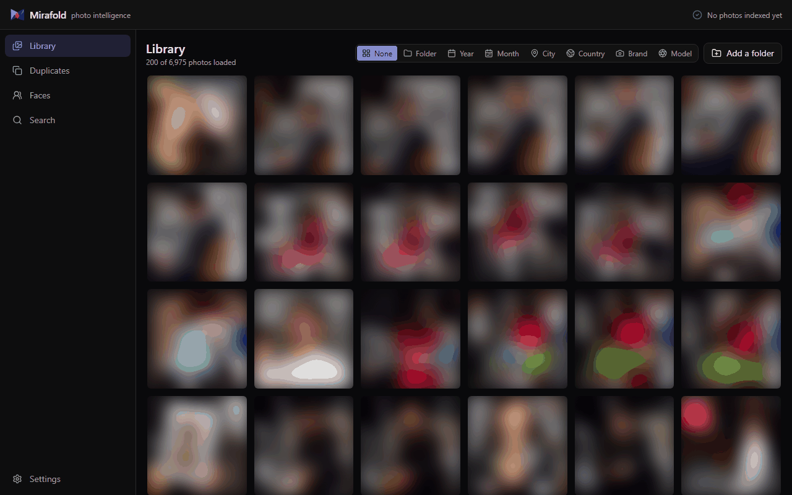

<div align="center">
  
  <h1>Mirafold</h1>
  <p><b>The local-first photo intelligence app for Windows.</b></p>
  <p>Find any photo with a sentence. Cluster faces. Dedupe duplicates. <b>All on your machine.</b></p>

  <p>
    <a href="https://github.com/amys94fr/mirafold/blob/main/LICENSE"></a>
    <a href="https://github.com/amys94fr/mirafold/stargazers"></a>
    
    
    
    
  </p>
</div>

---

## Why Mirafold

You have thousands of photos on your hard drive. Finding one specific shot means scrolling for an hour. You'd love something like Google Photos: type "dog in the snow" and get the right results, see all the photos of your sister automatically grouped together, find every blurry duplicate burning gigabytes.

**But you don't want your entire life uploaded to someone's cloud.**

Mirafold runs the same kind of AI photo intelligence — CLIP for natural-language search, modern face recognition, perceptual hashing for duplicates — directly on your PC. No accounts, no uploads, no telemetry. Your photos stay where they are.

## ✨ Features

- 🔍 **Natural-language search** — Type `"sunset over the ocean"`, `"my birthday with cake"`, `"crowded street at night"`. Powered by [OpenCLIP](https://github.com/mlfoundations/open_clip) ViT-B-32, 512-D embeddings indexed in SQLite.
- 👤 **Face recognition & people clustering** — OpenCV YuNet + SFace detect and embed every face, then Agglomerative Clustering groups them into people you can label.
- 🪞 **Duplicates & near-duplicates** — Perceptual hashing (pHash + dHash) finds exact copies and visually similar photos with a tunable similarity threshold (default 95%).
- 📍 **Place & date grouping** — EXIF GPS extracted and reverse-geocoded to city/country **offline**. Auto-group by folder, year, month, city, country, camera brand, or camera model. Each dimension is also a filter.
- 🖼️ **Lightbox & bulk ops** — Click to open full-size with prev/next nav, Ctrl+A to select all visible, send to Recycle Bin or rename in bulk with templates (`{n}`, `{date}`, `{orig}`).
- 🚀 **Incremental scans** — `mtime` + size cache. Re-scanning a folder of 10,000 photos with no changes takes seconds.
- 🔒 **100% local** — No cloud accounts. No telemetry. No internet required after model download (~600 MB OpenCLIP, ~37 MB face models, one time).

## 🎬 Demo



Library with grouping by year/country/camera, faces auto-clustered into people, semantic search returning photos that match a natural-language query. Faces in the demo above are intentionally blurred for privacy; on your own machine the photos are sharp.

## 🏗️ Architecture

```
┌────────────────────────────────────────────────────────────────┐
│                    Tauri 2 (Rust shell)                        │
│  ┌────────────────────────┐    ┌────────────────────────────┐  │
│  │   React 19 + Vite UI   │    │  Python ML sidecar         │  │
│  │   (WebView, dark mode) │◄──►│  FastAPI on 127.0.0.1:8765 │  │
│  └────────────────────────┘    │                            │  │
│                                │  • Scanner (pHash/dHash)   │  │
│                                │  • OpenCLIP (ViT-B-32)     │  │
│                                │  • OpenCV face pipeline    │  │
│                                │  • EXIF + reverse-geocode  │  │
│                                │  • Send2Trash / rename     │  │
│                                └─────────────┬──────────────┘  │
│                                              ▼                 │
│                            SQLite + sqlite-vec                 │
│                  (photos, embeddings 512-D + 128-D, clusters)  │
└────────────────────────────────────────────────────────────────┘
```

- **Rust** spawns the Python sidecar at startup, kills it on close (`kill_on_drop`).
- **React** talks to the sidecar over plain HTTP. CORS is whitelisted to `localhost` + `tauri.localhost`.
- **SQLite + sqlite-vec** stores everything in one file (`%LOCALAPPDATA%\Mirafold\library.db`). No server, no PostgreSQL, no Docker.
- **Photos are never copied or moved.** Mirafold only reads files and writes thumbnails to its own cache.

## 🚀 Quick start

### Prerequisites

- **Node.js 22+** and **pnpm 10+** (`npm i -g pnpm`)
- **Python 3.10 or 3.11** (3.12+ untested with all ML deps)
- **Rust stable 1.95+** (install via [rustup](https://rustup.rs/))
- **Windows 10 or 11**

### Install

```bash
git clone https://github.com/amys94fr/mirafold.git
cd mirafold
pnpm install
pip install --user -r apps/ml-service/requirements.txt

# Heavy ML deps (~700 MB torch CPU + models)
pip install --user torch torchvision --index-url https://download.pytorch.org/whl/cpu
pip install --user open-clip-torch opencv-python scikit-learn pillow-heif \
                   reverse_geocoder pycountry
```

### Run in dev

```bash
pnpm tauri:dev
```

First launch compiles ~440 Rust crates (~3–5 min). Subsequent launches use the cache and start in seconds.

### Build a Windows installer

```bash
pnpm tauri:build
```

Output: `apps/desktop/src-tauri/target/release/bundle/{msi,nsis}/`.

## 🆚 Comparison

| | **Mirafold** | PhotoPrism | Immich | digiKam | Google Photos |
|---|---|---|---|---|---|
| Local-first (no server) | ✅ Single binary | ❌ Docker | ❌ Docker | ✅ | ❌ Cloud |
| Natural-language search | ✅ CLIP | ✅ TensorFlow | ✅ CLIP | ❌ | ✅ |
| Face clustering | ✅ | ✅ | ✅ | ✅ | ✅ |
| Duplicate detection | ✅ pHash + dHash | ✅ | Limited | ✅ | ❌ |
| Setup time | < 5 min | 30 min Docker | 30 min Docker | Native install | Sign in |
| Re-encodes / moves files | ❌ Reads only | ⚠️ Optional | ⚠️ Imports | ❌ | N/A |
| Footprint | ~10 MB binary + ~1 GB models | ~3 GB Docker | ~3 GB Docker | ~500 MB | N/A |

Mirafold's sweet spot: **one user, one PC, photos already organized in folders, wants modern AI features without running a server**.

## 🗺️ Roadmap

- [x] Core ingest pipeline (scan, hash, thumb, EXIF, GPS, camera, reverse-geocode)
- [x] Duplicates detector (pHash + dHash, union-find grouping)
- [x] OpenCLIP semantic search (text → image)
- [x] OpenCV face detection + recognition + Agglomerative clustering
- [x] React UI with infinite scroll, lightbox, bulk actions, 8 grouping dimensions and live filters
- [ ] Map view (cluster GPS-tagged photos on a real map)
- [ ] Image → image semantic search ("find more like this")
- [ ] Smart albums (saved searches)
- [ ] HEIC import with native decoder fallbacks
- [ ] Sidecar packaged as standalone binary (PyInstaller) for `tauri build`
- [ ] macOS and Linux builds

Open an issue if you want to drive one of these or have other ideas.

## 🛠️ Tech stack

- **Shell**: [Tauri 2](https://tauri.app/) (Rust 1.95)
- **UI**: [React 19](https://react.dev/), [Vite 8](https://vite.dev/), [TypeScript 6](https://www.typescriptlang.org/), [Tailwind CSS v4](https://tailwindcss.com/)
- **ML**: [OpenCLIP](https://github.com/mlfoundations/open_clip), [OpenCV](https://opencv.org/) (YuNet + SFace), [PyTorch](https://pytorch.org/) CPU
- **Backend**: [FastAPI](https://fastapi.tiangolo.com/), [SQLite](https://sqlite.org/) + [sqlite-vec](https://github.com/asg017/sqlite-vec)
- **Misc**: [reverse_geocoder](https://github.com/thampiman/reverse-geocoder), [imagehash](https://github.com/JohannesBuchner/imagehash), [send2trash](https://github.com/arsenetar/send2trash)

## 🤝 Contributing

Issues and PRs welcome. Before submitting a PR:

1. Run `pnpm typecheck` in `apps/desktop/`.
2. Make sure the sidecar still starts (`python apps/ml-service/run.py` and `curl http://127.0.0.1:8765/health`).
3. If you touched the React UI, screenshot the change in the PR.
4. Keep prose ASCII-friendly (the project's print pipeline on Windows is cp1252-sensitive).

See [CONTRIBUTING.md](CONTRIBUTING.md) for the full guide.

## ⭐ Star history

If Mirafold saves you a few hours of photo scrolling, hit the star button. It directly influences who finds the project on GitHub.

## 📜 License

MIT — see [LICENSE](LICENSE). Built with ❤️ for people who'd rather keep their memories on their own hard drive.
